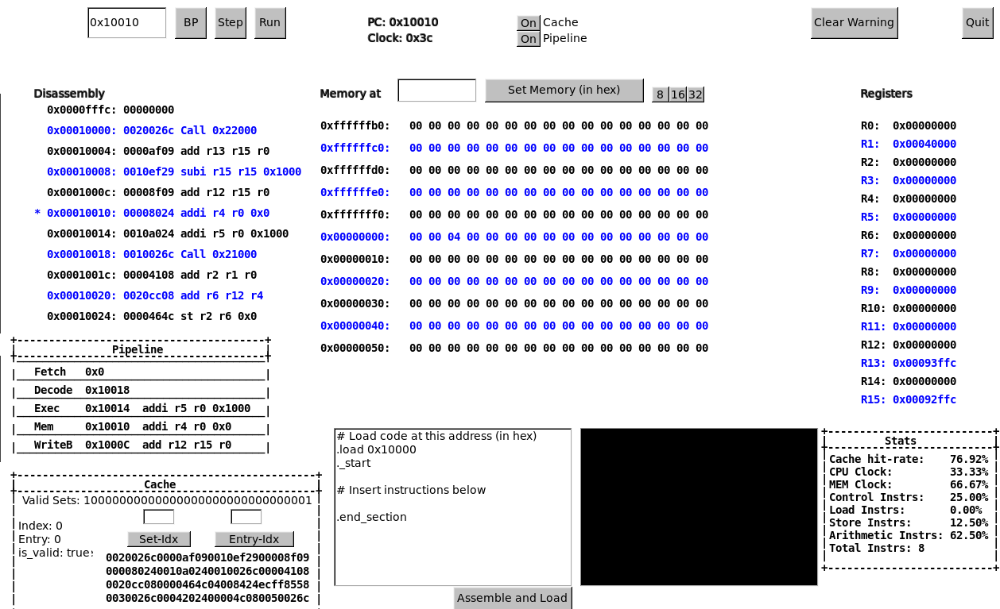

## 535 Project Proposal - Aquarium
##### Gilbert Hoermann - Spring 2023
##### Project-Repo: https://github.com/seal9055/isa_simulator

### Introduction
This architecture, named Aquarium, is a general purpose, 32-bit architecture modeled after RISC-V.
It has a fixed-size instruction length (32-bits), supports a 32-bit address space, interrupts,
privilege levels and paging-based virtual memory (including permission/privilege bits). It includes 
a zero-register (r0), 12 general-purpose registers (r1-r13), a link register (r14), a stack-pointer 
(r15), and an instruction pointer (pc). Aquarium makes use of the Von Neumann architecture design. 

It supports various integer-arithmetic instructions, memory load/stores, call-routines, conditional
branches, and interrupts. The architecture is executed using a standard 5-stage pipeline (Fetch,
Decode, Execute, Memory, Writeback). Each clock-cycle fetches a new instruction from memory in the
first stage, and executes the other stages accordingly. The instruction-set generally uses
three-address instructions for data manupulations (2 sources, 1 destination).

This implementation uses a single cache-layer. The cache is write-back, no-allocate, and 4-way set 
associative. It has a total size of 8Kb (32-sets * 4-entries * 64-bytes). Nothing in the ISA-design
prevents an expansion of this, so future iterations of Aquarium could contain multiple cache-levels
for further optimizations. Memory is addressed in little endian format, and can be adressed either 
1, 2, or 4 bytes at a time.

### Architecture
##### Interrupts
The Interrupt-vector table is mapped to physical address 0x0. Interrupts index this vector-table to 
retrieve a function pointer. This function-pointer is then invoked. After the interrupt is 
completed, the previously executing code resumes as if nothing happened.

##### Virtual Memory
This system uses a paging-based virtual memory model. All memory operations are performed on virtual
addresses. The simulator then traverses the page table to convert the address to a physical
address. Pages are of size 4096, with each level having 1024 entries. There are 2 page-table
entries, thus allowing ~1 million pages to be mapped at once.

The page-table entries include permission and privilege bits, so the processor can recognize if some
chunk of memory is executable or not, thus restricting execution to appropriately mapped pages.

Address Layout: `[table_1_idx:10][table_2_idx:10][offset:12]`
##### Cache  
- The cache is 4-way set associative
- Write-back & No-Allocate  
- Size: 8Kb (32-sets * 4-entries * 64 bytes)
- Cache accesses in this design have a 10-cycle latency compared to Ram (100-cycle latency)
- Cache entries are evicted based on an least-recently-used algorithm
- The pipeline can be enabled/disabled at will

Address -> Cache translation: `[Tag:21][index:5][offset:6]`

##### Pipeline  
- No structural hazards occur in this isa-design
- Data & Control hazards are both handled by stalling the pipeline
- The pipeline can be enabled/disabled at will
    - When disbaled, a single instruction goes through the pipeline at a time
1. Fetch
    - Fetch 4 bytes from memory
    - Advance pipeline-internal pc
2. Decode
    - Retrieve rs1, rs2, rs3, imm, and offset
    - Sign-extend Immediate field
    - Decode the instruction
3. Execution
    - if MEM    -> Construct addr
    - if RegOp  -> Compute result of operation
    - if RegImm -> Compute result of operation
    - if Branch -> Compute Branch-target & comparison result
4. Memory Access
    - pc = pc + 4
    - if MEM-LD -> Load value from memory into temporary Pipeline-Reg
    - if MEM-ST -> Load value into memory
    - if Branch -> Update pc to branch
5. Write Back
    - Write results of previous operations to rs3-registers if applicable

##### Mmio  
There is a memory mapped mmio region at physical-address 0x1000. This region behaves similar to
x86's vga-text-buffer. Bytes written to this region are displayed on a simple text-based screen on
the simulator. This lets processes running on the simulator directly transmit information to the 
user. It is used to eg. get a clock time stamp counter (basically rdtsc instruction), or signify the
the simulator to cleanly exit the simulation.

### Instruction Listing

##### Type-Layouts
|<!----> |<!---->|<!---->|<!---->|<!---->|<!---->|
|--------|-----|-----|-----|-------|------|
| opcode [:6] | rs3 [:5]   | rs1 [:5]     | rs2 [:5]  | empty [:11] | __R-Type__  |
| opcode [:6] | rs3 [:5]   | rs1 [:5]     | imm [:16] |             | __G-Type__  |
| opcode [:6] | rs3 [:5]   | offset [:21] |           |             | __J-Type__  |
| opcode [:6] | empty[:26] |              |           |             | __B-Type__  |

##### R-Type
|<!----> |<!---->|<!---->|<!---->|<!---->|<!---->|
|--------|-----|-----|-----|-------------|------|
| 000010 | rs3 | rs1 | rs2 | 00000000000 | __ADD__  |
| 000011 | rs3 | rs1 | rs2 | 00000000000 | __SUB__  |
| 000100 | rs3 | rs1 | rs2 | 00000000000 | __XOR__  |
| 000101 | rs3 | rs1 | rs2 | 00000000000 | __OR__   |
| 000110 | rs3 | rs1 | rs2 | 00000000000 | __AND__  |
| 000111 | rs3 | rs1 | rs2 | 00000000000 | __SHR__  |
| 001000 | rs3 | rs1 | rs2 | 00000000000 | __SHL__  |
| 011110 | rs3 | rs1 | rs2 | 00000000000 | __MUL__  |
| 011111 | rs3 | rs1 | rs2 | 00000000000 | __DIV__  |

##### G-Type
|<!----> |<!---->|<!---->|<!---->|<!---->|
|--------|-----|-----|-----|-------------|
| 011010 | rs3 | 00000 | imm | __LUI__  |
| 001001 | rs3 | rs1 | imm | __ADDI__ |
| 001010 | rs3 | rs1 | imm | __SUBI__ |
| 001011 | rs3 | rs1 | imm | __XORI__ |
| 001100 | rs3 | rs1 | imm | __ORI__  |
| 001101 | rs3 | rs1 | imm | __ANDI__ |
| 001110 | rs3 | rs1 | imm | __LDB__  |
| 001111 | rs3 | rs1 | imm | __LDH__  |
| 010000 | rs3 | rs1 | imm | __LD__   |
| 010001 | rs3 | rs1 | imm | __STB__  |
| 010010 | rs3 | rs1 | imm | __STH__  |
| 010011 | rs3 | rs1 | imm | __ST__   |
| 010100 | rs3 | rs1 | imm | __BNE__  |
| 010101 | rs3 | rs1 | imm | __BEQ__  |
| 010110 | rs3 | rs1 | imm | __BLT__  |
| 010111 | rs3 | rs1 | imm | __BGT__  |

##### J-Type
|<!----> |<!---->|<!---->|<!---->
|--------|-----|-----|-----
| 011001 | 00000 | offset | __JMPR__  |
| 011011 | 00000 | offset | __CALL__  |

##### B-Type
|<!----> |<!----> |
|--------|--------|
| 011100 |  __RET__   |
| 011101 |  __NOP__   |
| 101000 |  __INT0__  |

### Instruction Description

##### Arithmetic Reg-Reg Instructions
- Add - Add operation (Can over/underflow)
- Sub - Subtract operation (Can over/underflow)
- Xor - Bit-level xor operation
- Or  - Bit-level or operation
- And - Bit-level and operation
- Shr - Logical shift right
- Shl - Logical shift left
- Mul - Multiplication
- Div - Division

###### Usage: `op rs3 rs1 rs2`

These arithmetic instructions all operate fairly similarly. They take the values stored in `rs2` and
`rs1`, perform the requested operation, and store the result in `rs3`.

##### Arithmetic Immediate Instructions
- Addi - Add operation (Can over/underflow)
- Subi - Subtract operation (Can over/underflow)
- Xori - Bit-level xor operation
- Ori  - Bit-level or operation
- Andi - Bit-level and operation
- Lui  - Load Upper Immediate (takes value in rs1, performs a `shl 12` operation on it and stores to `rs3`)

###### Usage: `op rs3 rs1 immediate`

These arithmetic instructions all operate fairly similarly. They take the values stored in `rs1` and
the immediate, perform the requested operation, and store the result in `rs3`. The immediate is
encoded as a signed integer and stored in 11-bits, so immediates in range (-1024:1024) can be
encoded using this.

##### Memory Instructions
- Ldb - Load byte from memory
- Ldh - Load halfword from memory
- Ld  - Load word from memory
- Stb - Store byte to memory
- Sth - Store halfword to memory
- St  - Store word to memory

###### Usage: `op rs3 rs1 imm`

These memory operations reference memory in increments of 1, 2, or 4 bytes. Memory needs to be
properly aligned according to the instruction size. 

Store instructions take the value stored in `rs3` and write it to memory at `rs1 + imm`.
Load instructions read memory at `rs1 + imm`, and write the read value to `rs3`.

##### Conditional Branches Instructions
- Beq - Branches if rs3 and rs1 are equal
- Bne - Branches if rs3 and rs1 are not equal
- Blt - Branches if rs3 is less than rs1
- Bgt - Branches if rs3 is greater than rs21

###### Usage: `op rs3 rs1 imm`

The branch instructions perform their respective comparison operation and then perform a pc-relative
branch to `pc + imm`. The immediate is once again signed, so this can perform both forwards and
backwards branches.

##### Unconditional Control Flow
- Jmpr - Pc-relative direct jmp 
- Call - Direct jmp to offset with call-routine
- Ret  - Return from a subroutine

###### Usage: `op offset`

The `Jmpr` instruction performs a pc-relative control-flow change based on the signed offset.

The `Call` instruction pushes the link register to the stack and then directly jumps to the address
stored in the offset.

The `Ret` instruction is the counter-part to the `Call` instruction and is used to return from
function calls. It unconditionally jumps to the value in the link register and then pops the
previous link register off of the stack before resuming execution.

##### Misc
- Nop - Do nothing for this instruction
- Int0 - Invoke interrupt 0, function stored at interrupt-vector[0]
- Int1 - Invoke interrupt 1, function stored at interrupt-vector[1]
- Intn - Simulator can support as many interrupts as needed by the system running on top of it

### Simulator

The simulator includes an intuitive gui for easy use. Running the code can be done through
single-stepping, and by straightup running the code while supporting breakpoints. It includes
listings for an instruction-disassembly (this disassembly is updated in real-time, and thus supports
self-modifying code), a memory-view that can be panned to specific address-ranges
(and in 8, 16, & 32-bit reprsentations), and a register view. It also includes information on the
current pipeline and cache-state so users can monitor these architectural features. The window on
the bottom right also displays various runtime statistics.

Code can be loaded into the simulator either on launch as a commandline-argument, or via a text-box 
in the gui. An assembler included with the simulator assembles this into raw-bytes at load-time and 
places them into memory accordingly. 

The simulator also includes a small vga-text-buffer style screen that applications can write to
using mmio features. This mmio can also be used to get certain information from the host such as
clock-cycles, a random number, or to terminate the simulation.

The simulator layout is displayed below.

### User Manual
In general the gui is fairly intuitive. Code can be loaded either as a command-line argument (`cargo
run --release -- ./code/sorting`), or by entering it into the codebox on the screen and hitting the
`Assemble and Load` button. This requires a set code-format, for which examples are listed in the
`/code` directory.

Once loaded, the code can be executed through the top-left navigatoin buttons.
- Step: Step a single instruction
- BP: Set a breakpoint at address
- Run: Run program until breakpoint or exit

There are various windows that can be used for execution introspection. On the left side there are 2
disassembly views, 1 disassembling instructions around the current `pc`, and another displaying what
instructions are currently active in pipeline slots.

Below this is the Cache view. Since there are 32 sets, this view starts with a bitmap that describes
which of these sets currently has a valid entry (1) and which one doesn't (0). The actual memory in
each cache-entry can be printed out by setting the set-index and entry-index in the fields and
hitting the relevant buttons. 

The middle of the screen contains a memory view. This can display arbitrary memory addresses and
display memory in 8-bit/16-bit/32-bit format using the small buttons at the top-right of this area.

The very right displays all the registers/their values, and a statistics view at the bottom.

Finally the black-box in the screenshot above is a vga-buffer style area that programs can use to
communicate by printing to the screen using an mmio region.

### Demo Results
- Cache-access = 10 cycles
- Ram-access   = 100 cycles

##### Demo-1
- /code/sorting
- This demo sorts an array of 1024 randomly generated 32-bit integers using a selection sort
algorithm
- The demo executes a total of 7,858,285 instructions.

| Setup | Clock-Cycles | MEM-% | CPU-% | Cache Hit-Rate |
| --- | --- | --- | --- | --- |
| Cache=1 Pipeline=1 | 115,884,514 | 81.46% | 18.54% | 97.36% |
| Cache=1 Pipeline=0 | 118,299,464 | 66.67% | 33.33% | 96.83% |
| Cache=0 Pipeline=1 | 966,152,984 | 97.77% | 2.23%  | 0.00% |
| Cache=0 Pipeline=0 | 825,119,924 | 95.24% | 4.76%  | 0.00% |

##### Demo-2
- /code/matrix_mul
- This demo allocates a memory region to house 3 matrices of 10x10 32-bit integers. It then randomly initializes the first 2 matrices, multiplies them and stores the result to the third matrix.
- The demo executes a total of 28,008 instructions.

| Setup | Clock-Cycles | MEM-% | CPU-% | Cache Hit-Rate |
| --- | --- | --- | --- | --- |
| Cache=1 Pipeline=1 | 387,000 | 82.09% | 17.91% | 99.31% |
| Cache=1 Pipeline=0 | 420,914 | 66.73% | 33.27% | 99.23% |
| Cache=0 Pipeline=1 | 3,237,120 | 97.86% | 2.14%  | 0.00% |
| Cache=0 Pipeline=0 | 2,940,734 | 95.24% | 4.76%  | 0.00% |

### Management Plan
The project is developed in rust and makes use of the fltk gui library. Version control is done on
github, and all docs are written in markdown. I am working on the project on my own so I will be
completing every part of it.
